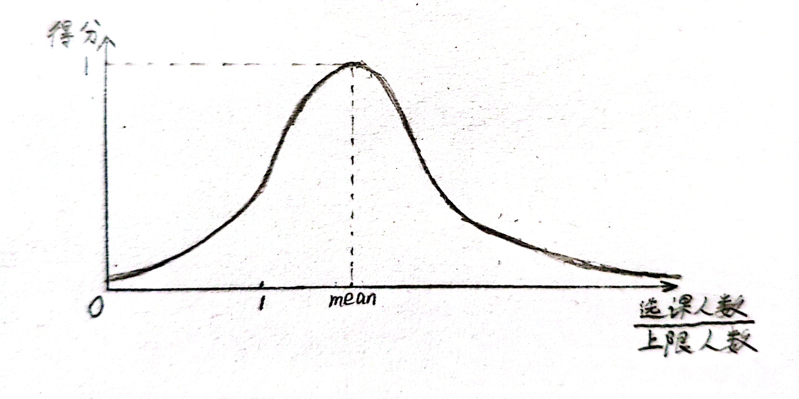

## 简介

用于复旦大学选课系统。

此程序帮助你排出没有课程冲突（上课时间冲突、期末考试时间冲突、最大门类限制）的课表。

---

## 使用前必需看的

0. 只能在选课期间使用。

1. 在[`config/user.py`](./config/user.py)中，将`USERNAME`、`PASSWORD`修改为你的学号和密码，将`SELECTED_COURSES_COUNT`修改为你已经选了的课的数量。

2. 在[`config/course_codes.csv`](./config/course_codes.csv)中：

    - 第一列是你要选的课程的课程代码，比如`MATH120017`。
        - 请确保你所填写的课程代码的正确性和完整性，如果填写了错误的课程代码导致查不到课程，或者填写了不完整的课程代码，程序将会报错。
        - 请确保你所填写的课程代码的唯一性，如果有多行的课程代码是相同的话，只有最后一行是有效的。

    - 第二列是你给这个课程代码自己打的标签，比如`数学分析`。（不同的课程代码可以对应同一个标签）

    - 其他列会被忽略，自己想备注啥就备注啥。

3. 在[`config/tags.csv`](./config/tags.csv)中：

    - 第一列是你刚刚打的标签，比如`数学分析`。

        - 请确保你所填写的标签的正确性，它们应该要在`config\course_codes.csv`的第二列出现。如果填写了没有出现过的标签，且该标签对应的第二列的值是正整数，将无法排出课表。

        - 请确保你所填写的标签的唯一性，如果有多行的标签是相同的话，只有最后一行是有效的。

    - 第二列是一个整数`n`，比如`2`，它的含义是：拥有这个标签的课要选`n`节。

    - 其他列会被忽略，自己想备注啥就备注啥。

4. 运行[`main.py`](./main.py)以启动程序。
5. 在[`result`](./result)文件夹下的最新文件即为生成的课表。可以用 [WPS](https://www.wps.cn/) 打开 `.csv` 格式的文件，建议将列宽调大。
6. 免责声明。

---

## 使用前建议看的

### 课程得分

基于这两个事实：
- 选的人数越多，这门课的质量就越高。
- 选的人数越多，这门课就越难选到。（仅限一轮）
  

给课程评分。选的人太少或太多都会降低这门课的得分。具体的得分函数为：

这个函数是由正态概率密度函数经过纵坐标放缩得到的。

- 纵坐标代表课程得分，满分为1分；横坐标是这门课的选课人数在上限人数的占比，即 $\frac{selectCount}{limitCount}$ 。

- 该正态曲线的**均值**`mean`为[`config/user.py`](./config/user.py)中的`OPTIMAL_PROPORTION_OF_SELECTION`的值，即，你认为的最佳选课人数占比。
- 经过放缩之前的正态曲线的**标准差**由[`config/user.py`](./config/user.py)中的`SIGMA`提供。

### 课程表得分

**课程表的得分**由两部分构成：

- **课程得分**。
- **通勤时间**。

#### 课程表的**课程得分**

将课程表内所有课程的得分按照学分进行加权，计算几何平均。

具体来说，设一个课程表里有 $n$ 门课程，记第 $i$ 门课程的得分为 $score_{i}$ ，记第 $i$ 门课程的学分为 $credit_{i}$ ，则该课程表的课程得分为

$$
courseScore = \left( \prod_{i = 1}^{n}{score_{i}^{credit_{i}}} \right)^{\frac{1}{\sum_{i = 1}^{n}{credit_{i}}}} = \exp(\frac{\sum_{i = 1}^{n}{credit_{i} \ln(score_{i})}}{\sum_{i = 1}^{n}{credit_{i}}})
$$

#### 课程表的**通勤时间**

一周里，在各个上课地点跑来跑去的路上所花的时间。

路线：寝室 → 最近的食堂 → 上午的上课地点 → 最近的食堂 → 下午的上课地点 → 最近的食堂 → 晚上的上课地点 → 寝室

“寝室”的定义位于[`config/constants.py`](./config/constants.py)中，`DORMITORY_CODE`是寝室代码。（暂时不支持修改宿舍楼，因为我还没有测量各宿舍楼的经纬度）

#### 课程表的**综合得分**

记该课表的通勤时间（单位：小时）为 $t$ ，课程得分为 $s$ ，通勤时间所占的权重为 $w_t$ ，课程得分所占的权重为 $w_s$ ，则综合得分为

$$
{((\frac{1}{t})^{w_t} \times {s}^{w_s})} ^ {\frac{1}{w_t + w_s}}
$$

简称为**课程表的得分**。

在[`config/user.py`](./config/user.py)中：

- `COMMUTE_TIME_WEIGHT`是通勤时间所占的权重，即 $w_{t}$ 。
- `COURSE_SCORE_WEIGHT`是课程得分所占的权重，即 $w_{s}$ 。

---

## 使用前可以不看的

[`config/user.py`](./config/user.py)中的`FULL_OK`：如果`FULL_OK`为`False`（默认值），那么在第二轮或第三轮选课时，就不会把那些满员了的课（已选的课程除外）排入课程表。

- 注意：如果是在第一轮选课，或者`FULL_OK`为`True`，那么在排课表的时候会把那些满员了的课也排入课表，此时程序会非常耗时（根据你要选的课的数量，从10分钟到4小时（预测）不等）。

[`config/user.py`](./config/user.py)中的`MAX_SCHEDULES_TO_OUTPUT`：输出的课表数量上限。取得分最高的`MAX_SCHEDULES_TO_OUTPUT`（默认为`10`）份课表输出。

- 注意：如果可行方案少于`MAX_SCHEDULES_TO_OUTPUT`种，将只输出可行的那几种。

在运行程序的过程中，很有可能会发生`ValueError: unknown building which this room belongs to`错误，这说明查询到的课程中，有教学楼的经纬度还没有被测量。

---

## 未来

- 多线程来优化筛选课表的性能。
- 更多的约束条件来筛选课表。
- UI 界面。
- 通过旦夕的评教，更科学地为课程评分。
- 通过[复旦大学在线课表查询](http://10.64.130.6/)，安排无课时间段的自修教室。
